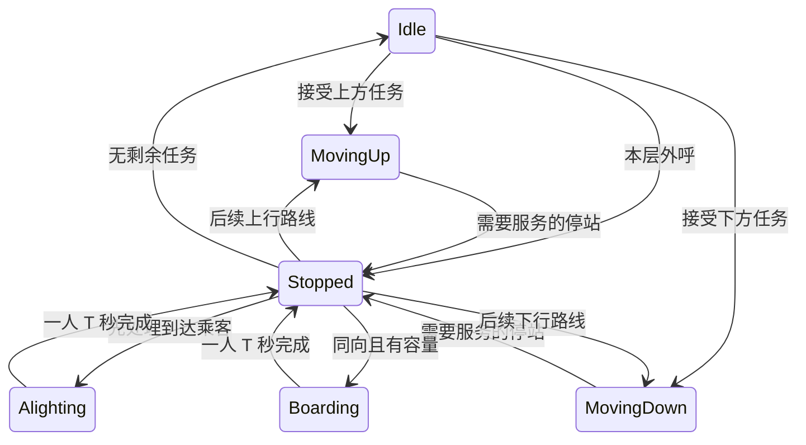

# 核心仿真算法与接口设计

## 1. 调研依据与选择

初版核心实现参考了以下论文、课程资料和厂商文档；本次改动对照现有源码和回归测试，增加有限联合分配与滞回改派。下列来源用于算法思想，代码为本项目实现，没有复制博客程序。

| 方案 | 思想 | 优点 | 局限与本项目选择 |
| --- | --- | --- | --- |
| 方向集选 collective control | 按行进方向服务已有内部目标及同向外呼 | 容易解释，符合方向保持规则 | 单独使用不能完成多梯分配；作为单梯基础 |
| SCAN / LOOK | 保持扫描方向，LOOK 到最后待处理位置才折返 | 不因新请求立即反向；避免无任务仍走到端点 | 这是借用课程中的扫描思想，不能直接把磁盘算法当成完整电梯控制器 |
| nearest-car | 选择距离较近的可响应梯 | 简单，适合作为比较基线 | 单纯绝对距离忽略返程、停靠与负载；不作为最终选择器 |
| ETA | 基于可观测内外呼和固定服务成本估计接客时间 | 能表达反向绕行、上下客及容量变化 | 未来新增乘客及后续分配可能改变路线，不保证未来实际到达时间 |
| 代价式 Hall Call Assignment | 按 ETA、负载等因素对所有电梯评分 | 可解释、可拆分测试 | 不声称全局最优；避免大量无单位权重 |

主要来源：

1. [Richard Peters, Elevator Dispatching, ELEVCON 2014](https://download.peters-research.com/library/Elevator_Dispatching.pdf)：方向集选、最近梯、ETA 的比较，强调中间停靠对响应时间的影响。
2. [Siikonen, Elevator Group Control with Artificial Intelligence](https://sal.aalto.fi/publications/pdf-files/rsii97a.pdf)：参考其集选、任务方向保持与群控背景；没有实现其中的 AI 策略。
3. [University of Pittsburgh, Disk Scheduling 课程资料](https://people.cs.pitt.edu/~pranut/OLD/CS1550/WeekFinal/Recitation%20-%20Final%20Week.pdf)：SCAN 与 LOOK 的扫描终点区别。
4. [Nidec / MCE, Motion Group Control 技术手册](https://acim.nidec.com/elevators/-/media/Project/Nidec/NidecElevator/MCE/PDFs/Motion-Group-Control-B5.pdf)：以响应时间及时间形式的附加项表达分配偏好。本项目未复制其厂商参数。
5. [Peters 等，A Systematic Methodology for the Generation of Lift Passengers under a Poisson Batch Arrival Process](https://joomla.peters-research.com/index.php/support/articles-and-papers/163-a-systematic-methodology-for-the-generation-of-lift-passengers-under-a-poisson-batch-arrival-process)：参考指数间隔与乘客到达模型比较。本项目取单人齐次 Poisson 简化，没有使用批量到达或固定总人数的时间伸缩校正。

## 2. Dispatcher：统一 Cost/ETA + LOOK 路线

`SelectElevator(floor, direction, const vector<Elevator>&)` 保留原签名与无副作用职责。先生成只读 `ElevatorDispatchSnapshot`，再调用同一套 `SelectFromSnapshots` 评分。后者也用于构造明确的测试场景，无需为测试开放 private 字段。

候选排除：非法楼层/方向、顶层向上或底层向下、非有限时间参数、无效任务/服务快照，以及预演到请求层完成下客后仍无空位的梯。当前满载梯若预测在请求层接客前释放容量，可以参与候选；若到请求层仍满载，则不分配。全组无法分配时返回 `InvalidElevatorId`。

空闲梯与同向顺路梯不再使用绝对优先等级，而是统一计算成本。方向因素保留为有限的策略成本：同向顺路和空闲梯方向成本为 0；请求不在当前行进方向前方的忙碌梯增加 `S+T`。实际折返、中间停靠和当前动作剩余时间仍由 ETA 计算，因此该附加项用于表达反向/非顺路风险，不是把顺路梯硬排在空闲梯之前。

比较键按以下顺序排列，前一项不同就不比较后一项：

1. AdjustedCost（仿真秒），下式中的 ETA、估计负载、方向成本与有上限的 Aging 折扣。
2. ETA（仿真秒），即可以开始服务该外呼的时间，包含当前动作剩余时间、中间服务、移动以及请求层必须先完成的下客；不包含该外呼自身的上梯 T。
3. 当前整数楼层至请求楼层的绝对距离。
4. 上下行任务集合的元素总数。
5. 电梯 ID；完全相同的重复 ID 输入最终保持容器先后顺序。

```text
ETA = 当前动作剩余时间 + 后续移动层数 × S + 未知外呼停站数 × T + 估计内呼下客数 × T
LoadCost = T × 请求层完成下客后的 projectedOccupancy / capacity
DirectionCost = 空闲或顺路时为 0，否则为 S + T
AgingBonus = min(8.0, max(0, currentTime - firstRequestTime) × 0.05)
AdjustedCost = ETA + LoadCost + max(0, DirectionCost - AgingBonus)
```

路线与 `Elevator::HasTasksAhead` / `ChooseActionAtFloor` 保持同样的规则：所有内呼、Up 外呼和 Down 外呼共同决定当前方向是否还有前方任务；内呼在抵达时停站，外呼只在服务方向一致时停站。方向前方只有反向外呼时，仍须走到那个折返点，不能提前反向。例如 5F↑、8F↓ 外呼和新请求 3F↑，必须先到 8F 再回 3F。层间运行先完成已开始路段，不能因新请求立刻回头。空闲梯按接第一个外呼时的方向开始。

### 基于可观测状态的容量估计 + FIFO 实际服务

Simulation 知道完整乘客状态；Dispatcher 只使用传统楼层上下行按钮群控可获得的信息。`HallCallDispatchSnapshot` 只含楼层、方向、首次请求时间和用于稳定排序的队头 ID，不含真实 waitingCount 或目标层。`HallCallSnapshot` / 观察页仍显示真实等待人数，但人数不进入评分或联合路线预测。

`ElevatorDispatchSnapshot::StopService` 只公开楼层和方向：Idle 为已知 Car Call，Up/Down 为外呼。同层 Car Call 是一个按钮，不公开究竟有几个人下车。`Elevator::GetDispatchSnapshot` 不导出 pendingTarget；乘客完成 Boarded 后，目的层才成为可用于 ETA 的真实 Car Call。Simulation 构造调度快照时只同步动作剩余时间，不再从 Floor / Passenger 回填队列信息。

估计规则如下，S/T 均为仿真秒：

- 初始估计载荷为 passengerCount + 当前 Boarding 的一席预留；当前未满载有接客能力。
- 沿原 LOOK 消费每个不同 Car Call 一次；有估计载荷时最多下 1 人、计 T、释放一席，不使用精确目的层人数。
- 每个未知外呼停站固定计一个 T；有剩余容量时最多上 1 人。没有未知乘客的目的层，因此不增加未来内呼或猜测扫描终点。估计满载时外呼仍保留固定停站成本，不增加人数。
- 请求层先处理估计下客，再判断是否有空位；ETA 不含该请求自身的上客 T。当前满载且接客前无已知内呼则不可行；存在之前或请求层的内呼则可估计释放一席，但更早外呼可能占用这一席。
- 当前 Alighting 的一人只计 remainingActionTime，释放一席并消费当前内呼，不再估计同层其他下客。当前 Boarding 的一人已由预留席位和 remainingActionTime 覆盖，不能再为当前外呼加一人或完整 T；其目的层仍未知。

LoadCost 使用接客前估计载荷，上限为一个 T；Aging 保持连续斜率和 8 秒上限，仅抵消有限方向成本。Joint Dispatch、Reassignment、DeferredCapacity、FleetRebalancer 与 Coverage 共用 ScoreSnapshot，不存在另一套 ETA 或容量规则。Deferred 仍为临时预筛结果，不丢请求、不改队头和 Aging；Boarded / Alighted、路线撤销/改派等现有事件触发重新估计。

真实运行保留 Elevator 原状态机及 T 秒/人的 Boarding / Alighting。FIFO 只在实际到站时通过 Floor::Peek / RemoveFront 决定上客顺序。估计允许与真实耗时和可用容量不同，通过动态重评估和改派持续修正，不能承诺所有客流均优于最近梯或声称全局最优。

接口迁移：SelectElevator / SelectFromSnapshots / ScoreSnapshot 签名不变；调度快照删除 boardingTargetFloors、HallCallDispatchSnapshot.targetFloors / waitingCount，以及 StopService 的 boardingCount / alightingCount。手工构造 StopService 只传楼层、方向；不再接受旧精确人数快照。

回归覆盖：改变等待目的层或队列长度时 Score / ETA / assignment 完全一致；Boarding 目的层隐藏、Boarded 后可见；同样内呼集合和载荷但不同下客人数分布的评分相同；满载的有/无前方内呼、请求层下客、重复内呼不重复释放、先下后上再次满载、双向 LOOK 消费、当前动作计时、实际 FIFO，以及固定 seed / Sequential / Parallel / 大小 Update 确定性。108 组混合路线另检查估计服务时间与真实 LOOK 移动路程的界限。

### Sequential / Parallel 候选评分

`ElevatorDispatcher` 保留 Sequential 和 Parallel 两种执行模式。Parallel 模式只把同一请求对各 `ElevatorDispatchSnapshot` 的 `ScoreSnapshot` 调用提交到一个固定大小的 C++17 线程池；ETA、Cost、feasible 都只读取值快照，任务之间没有共享写入。不会创建“一部电梯一个 OS 线程”，线程池在 Dispatcher 生命周期内复用，析构时停止并 join 全部 worker。

评分结果按原电梯容器下标写回数组，待全部 future 完成后，调用 Simulation 的线程仍按 Cost、ETA、距离、任务数、elevatorId 的稳定规则统一比较。线程完成顺序不会进入比较键。动态改派的其他候选和联合分配每层递归中的 N 台候选使用同一批量评分；联合搜索的递归结构、最多三候选、64 叶上限及叶组合最终复评保持串行原样。Simulation 对真实 Elevator/Hall Call 的撤销、添加和移动提交也仍是单线程。

默认直接构造的 Simulation/Dispatcher 使用 Sequential，便于原测试和兼容调用；UI 的 SimulationWorker 显式启用 Parallel。`SetDispatcherExecutionMode(mode, workerCount)` 可指定固定线程数；显式非零值保持原值，0 表示使用 `min(hardware_concurrency-1, 8)`（最少 1）。fixed seed 回归在每个仿真秒比较两种模式的电梯、乘客、外呼归属和统计，结果一致。

### 带滞回的动态重分配

`ScoreSnapshot` 提供可行性、ETA、Cost 和估计载荷，供原选择器、改派和联合分配共用；没有新增第二套 ETA。`SelectReassignment` 先计算原梯评分，再在其他可行候选中按 ETA、Cost、距离、任务数、ID 选择最好者。原梯可行时要求 `CurrentETA - BestETA >= ReassignThresholdSeconds`；原梯预测到请求层无座位时允许立即寻找替代，绕过普通临近锁、冷却和收益阈值，其他梯仍须通过完整容量校验。没有可行替代时保留归属，等待后续事件。

阈值统一在 Dispatcher.h：收益阈值 5 仿真秒、`ReassignLockDistanceFloors=1`、`ReassignCooldownSeconds=10`。请求层真正 Stopped/Boarding/Alighting 且非 betweenFloors 始终保护，不能抢走传送中的乘客。其余情况下只有可行原梯使用普通保护：冷却自实际改派开始；临近锁要求 betweenFloors、MovingUp 且请求层在上方，或 MovingDown 且请求层在下方，并且整数楼层距离 <=1。currentFloor 相同但已驶离、相邻却正在远离或尚未移动，都不构成“正在接近”。

Simulation 在新乘客、到达楼层、上下客完成及服务状态变化时置 `m_dispatchDirty`。纯 Update 帧边界不置脏，因此不会因帧率或 Aging 的连续时间变化额外抢单。一个仿真时刻只对已分配请求评估一轮，按楼层/方向稳定顺序处理；可行原梯在冷却期内不能反向抢回。不可行原梯可在下一个事件重评估时立即改派，但仍不绕过同一时刻只评估一轮的约束。

提交时仅针对已选中的两台梯准备副本：旧梯 `RemoveHallCall`，新梯 `AddHallCall`，成功后通过 noexcept 移动回写并同步 `assignedElevatorId` / `lastReassignmentTime`。准备期间失败不留下半次改派。此副本仅用于提交，候选搜索从不调用真实 Elevator 来试组合。撤销接口只删除指定方向 Hall Call；当前层 Stopped/Boarding/Alighting 禁止，Moving 中已离开的整数层允许撤销。它不改变当前动作、方向、计时或内呼任务，下一次正常事件仍由原状态机决定继续/折返。

### 最老三个 Active 请求的有限联合分配

Simulation 收集未分配外呼，按 firstRequestTime、firstPassengerId、楼层/方向 key 排序。每批构建一次完整 ElevatorDispatchSnapshot，逐个用现有 ScoreSnapshot 扫描候选：至少一台 feasible 即为 Active；全部不可服务为临时 DeferredCapacity，跳过且不占 MaxJointRequests=3。扫描直到取满最老三个 Active 或遍历完 pending。预筛与 PlanAssignments 使用同一份快照，不另写容量或 ETA 算法。

Deferred 只是本次快照上的分类，不增加永久状态或 UI 公共字段。真实 Floor 队列、HallCall、firstRequestTime 和 firstPassengerId 均不改动；恢复 Active 后 Aging 继续累计，后到同方向乘客不能绕过队头。DeferredCapacity 是核心调度语义，灰色“等待运力”仅是未来 UI 可选表现。

同一 DispatchCalls 内提交本批后重新收集 pending、重建快照并重新预筛，不等待下一次物理事件。直到没有 Active pending 或当前 Active 批次 assignedCount=0 退出。成功批次至少分配一个请求且不新增 pending，因此最多初始 pending 数个成功批次，加至多一个失败批次；全部 Deferred 时也能立即结束，不发生零时间死循环。前三个 Deferred、后面三个 Active 时，后面三个直接组成联合批次。

Alighted、外呼释放等模型事件继续置 m_dispatchDirty；改派中的撤销/添加已经在当前 DispatchCalls 内完成，随后窗口预筛使用重建后的快照。容量释放或路线结构变化都会重新评估 Deferred；纯 UI 快照读取或无模型事件的帧边界不触发扫描，没有独立定时器或额外仿真时间事件。ETA 已能预见已知下客，因此请求可能在实际 Alighted 前就因路线顺序变化恢复 Active，不能故意等实际释放后再接单。

每层递归先根据前面已经插入的任务重新评分全部 N 台梯，再保留最优 3 台；连同“暂不分配”分支，深度最多 3、叶组合最多 `(3+1)^3=64`，不是 N³。搜索只维护局部快照，给空闲梯插入第一项任务时记录与真实 AddHallCall 相同的起步方向和当前路段，后续请求不能重新选择该起步方向。同梯接多个请求时，每个外呼的一人服务估计参与之后的 ETA/容量预测，不增加未知目标层。

叶组合重新计算所有已选请求在最终路线下的 ETA 和估计载荷，防止只累加“插入时成本”而漏掉后续任务对早先请求的影响。方向惩罚保留各请求插入前的上下文（包括 Aging），避免把原来空闲梯的首项任务事后重复惩罚；ETA 和 LoadCost 使用最终路线数值。

先寻找可分配数量最多的可行方案，避免全不分配的零成本方案胜出；数量相同时按总 AdjustedCost、最大单请求 ETA、总 ETA、最老请求顺序中的电梯 ID 比较。没有足够容量时允许部分请求保持 -1。重复电梯 ID 则稳定保持输入顺序；未分配在 ID 比较中置于已分配之后。

两请求反例：S=2、T=3、capacity=10，E1 在 5F、E2 在 1F 且均空闲，最老请求 4F↑，随后 6F↑（尚未上梯的目的层不参与评分）。贪心先选 E1 响应 4F（2 秒），E1 已向下起步且存在后续服务，使 6F 请求选 E2（10 秒），总成本 12 秒。联合分配先让 E2 接 4F（6 秒）、E1 接 6F（2 秒），总成本 8 秒；不能据此推断任意客流更优。

### 固定基线对照与性能

下表是 `0fade61` 对 `e7b96a6` 联合分配初版的历史实测，不是本轮边界修复后的结果。脚本仍可用于对当前源码重新测量；本轮双架构回归与压力测试结果见 README。

运行 `powershell -NoProfile -ExecutionPolicy Bypass -File Tests/RunDispatchComparison.ps1 x64`。脚本通过 git archive 导出基线提交 `0fade614d5095eb14b3cb63916af876f3d2e1aa3` 的源码，只写 build，不改分支。两版使用同一 `DispatchComparison.cpp`、同一 MSVC x64 `/O2 /MD`、seed=321；每场景运行 3 次取平均运行耗时，不含编译。支持将参数改为 x86。脚本使用 UTF-8 BOM，生成批处理为 UTF-8/CRLF 并设置代码页 65001，支持中文仓库路径。

| 场景 | 平均等待旧/新（仿真秒，含上梯 T） | 已完成接客延迟总和旧/新（仿真秒，不含自身上梯 T） | 本机运行时间旧/新（ms） |
| --- | --- | --- | --- |
| L=20、N=3、K=4；同时 9F→20F、11F→1F | 13 / 12 | 20 / 18 | 0.031 / 0.086 |
| 同配置；0 秒 15F→20F，2 秒新增 17F→1F | 41 / 12 | 76 / 18 | 0.015 / 0.038 |
| 90 人批次，N=6、K=3、S=0.5、T=0.25 | 13.0889 / 13.1806 | 1155.50 / 1163.75 | 1.07 / 11.76 |
| 2000 人，同批次规则 | 306.5200 / 304.2986 | 612540.00 / 608097.25 | 54.14 / 356.12 |
| N=6、K=4、S=0.3、T=0.2、λ=8、600 秒 | 60.5609 / 62.2858 | 205347.68 / 213078.39 | 91.23 / 4043.81 |

有限场景全部送达。高客流两版均生成 4815 人，旧/新分别送达 3381/3418，队列等待 1413/1383，仍在乘梯 21/14；已上梯均值及响应延迟总和的样本数量不同，不能直接视为全体等待改善。90 人场景存在退化，运行开销普遍增加。

每批窗口预筛最多 P×N 次 ScoreSnapshot（P 为当前 pending 数，找到三个 Active 即停止扫描）；随后三请求搜索至多 21N 次前缀候选评分，加至多 192 次叶请求复评。单次 ETA 自身随已知按钮任务数量增长，不随真实等待人数增长。DispatchPlan 的 evaluatedCombinations / scoreEvaluations 仅统计联合搜索，不包含预筛；60 台电梯回归确认单批组合仍不超过 64。一次事件可执行多个批次，64 不是整次事件的上限。每轮改派还需约 H×N 次评分（H 为已分配外呼数），成功改派后重建快照；多批分配期间不重复改派。历史初版约 4 秒跑完 600 仿真秒仅是本机结果，不是实时性能保证。

当前并行评分的独立微基准使用 `Tests/RunDispatchPerformance.ps1 x64`、MSVC `/O2 /MD`、120 层混合 LOOK 任务、每种 N 运行 120 次选择。本机使用默认上限 8 个线程，结果如下；所有串并行选择序列一致：

| N | Sequential ms/次 | Parallel ms/次 | 加速比 |
| ---: | ---: | ---: | ---: |
| 6 | 0.0709 | 0.0555 | 1.28× |
| 30 | 0.3765 | 0.1453 | 2.59× |
| 60 | 0.7661 | 0.1938 | 3.95× |
| 120 | 1.4911 | 0.3342 | 4.46× |

这是候选评分微基准，不包含 MFC、Snapshot 复制或真实墙钟调度；任务更短、N 更小或核心更少时，线程池调度开销可能抵消收益。

## 3. Elevator：方向保持与动作事件

沿用原状态，不添加第二套运行枚举：



`AddHallCall` 只接收已经由 Simulation 分配的外呼；`AddInternalTarget` 接收内部停靠。分别保存上下行外呼和内部目标，公共上下行任务查询为这些任务的合并只读视图。内部乘客只存 ID，另存 ID→目标楼层数值，不保存 Passenger 地址。

`RemoveHallCall` 是本次唯一新增的单梯操作：请求在当前楼层或不存在时返回 false；否则只撤销该方向外呼并重建任务视图。同层内呼、另一方向外呼、乘客及当前动作时间都保留。其余状态机代码未修改。

新请求在非 Idle 状态只登记任务，不修改方向或重置当前计时。电梯到达整层、本次停站完成后才能决定继续或折返。只要前方仍有已接受任务，就保持扫描方向；逆向外呼在前方时会在回程或该扫描的折返点服务。空车为了接人可以先朝呼叫楼层移动，再在允许折返的位置采用乘客方向。

`Advance(simulationSeconds)` 最多推进到一个动作完成事件，返回 `ElevatorEvent.elapsedTime`。调用者必须处理事件，再继续剩余预算；不能把大预算当作已全数消耗。`GetTimeToNextEvent()` 返回下一层或本次一人传送的剩余秒数，Idle/Stopped 没有自行完成的定时动作，返回 infinity。

移动完成才更新整数楼层；上下客每次仅一人、均耗时 T。`BeginBoarding` 检查方向、目标、重复 ID、容量以及是否还有未下完的乘客，并预留一席。完成 T 后才加入乘客 ID 和内部目标。下客同样在 T 完成后移除 ID。在传送过程中不允许 `FinishStop`；存在到站乘客时不得先上客或离站。

没有独立开门/关门耗时，也没有加减速模型。Stopped 是交给总控制器处理的事件边界，通常在同一时刻立即进入下一项有效动作。

## 4. Simulation：事件推进与外呼生命周期

MFC 主线程不再持有或直接调用 Simulation。`SimulationWorker` 的独立工作线程构造唯一真实 Simulation，并成为 Elevator、Passenger、Floor、Hall Call、Statistics 与随机数状态的唯一写入者。Start/Pause/Resume/Reset/Stop 是一个互斥量保护的 FIFO 命令队列；队列只传枚举命令，不传核心对象引用。

工作线程运行时以 `steady_clock` 每约 16 ms 计算一次真实 delta，再调用原 `Simulation::Update`；核心内部仍只在这一处乘 simulationSpeed。处理 Pause 前会先推进到当前采样点，Pause/Resume/Reset/Start 后立即重置墙钟基点，因此暂停期间等待的真实时间不会进入恢复后的 delta。Stop 唤醒工作线程、发布 `workerActive=false` 的最后快照并 join；线程池也随 Dispatcher 正常 join，不使用 detached thread。

每次命令或推进后，Worker 在自身线程调用 `GetUISnapshot()`，按值复制 UI 实际使用的电梯、楼层、Hall Call 和统计视图，再通过 C++17 `atomic_store(shared_ptr<const SimulationUISnapshot>)` 发布。高频 UI 快照不复制 Passenger 明细；测试和后续按需功能继续使用独立 `GetPassengerSnapshots()`。MFC 33 ms Timer 只 `atomic_load` 最近快照并更新控件，既不调用 Update，也不扫描或修改 Simulation。共享可写区域仅有短命令队列和最新 shared_ptr，没有给核心各容器增加 mutex。

Coverage 也在 Worker 线程中由真实 `ElevatorDispatchSnapshot` 只读计算。为避免 100 层×99 梯时对每个 16 ms 推进都做全量 LOOK 预演，Worker 最多每 250 ms 重算一次并把结果随高频 UI Snapshot 发布；每次重算均使用该时刻的完整快照，不缓存或修改调度状态。

UI 只传真实秒；唯一乘倍速的位置是 `Simulation::Update`。本轮最大仿真增量先截断到总时长。消耗时间的事件由 `EventScheduler` 的 `priority_queue` 最小堆管理：PassengerArrival、OfficeDay 的 TrafficPhaseChange、SimulationEnd，以及每台 Moving/Boarding/Alighting 电梯唯一的 ElevatorAction。每梯另存绝对动作完成时刻；Update 直接跳到堆顶时间，只对事件所属电梯调用 `Advance`，不再扫描所有电梯的下一动作或推进未到期电梯。事件间隔内电梯状态不变，`AdvanceClockTo` 仍遍历全部电梯累计该段状态统计。

事件全序依次比较绝对时间、类型（ElevatorAction、TrafficPhaseChange、PassengerArrival、SimulationEnd）、ElevatorAction 的电梯 ID，最终用单调 sequence 消除完全相同键的偶然顺序。同一时刻先按 ID 完成全部电梯动作，再切换客流阶段、产生到达乘客，最后只调用一次 `StabilizeCurrentTime`，并为新进入计时状态的电梯补入后续事件。每次停站先下后上；开始 Boarding/Alighting 只是登记计时，完成必须等待后续事件。零耗时决策循环不会消耗 S/T，并设有依任务数计算的收敛保护，错误不会被静默忽略。

由于未到期电梯不再随全局时钟反复执行部分 `Advance`，其对象内 `m_actionRemaining` 保留动作开始时的完整时长。Simulation 构造调度快照时用 `max(0, scheduledCompletionTime-currentTime)` 覆盖 `remainingActionTime`，因此 Dispatcher 的 LOOK/ETA/Cost 公式无需修改。暂停不改变日历中的绝对仿真时刻；Reset 清空旧历并用原 seed 重建首次到达与 SimulationEnd。截止时刻允许先完成恰好到期的 ElevatorAction，但不生成恰好截止的乘客，也不再启动新的零耗时后续服务。

Hall Call 用 `(真实楼层, Up/Down)` 作为唯一键。每个方向外呼最多一台负责梯，尚未分配时 ID=-1。同一方向后来产生的乘客加入同一 FIFO 队列；待分配外呼跳过临时 Deferred，按最老三个 Active 连续分批规划。已分配请求在事件触发时按上述服务锁、原梯可行性及滞回条件改派，不在每帧反复抢单。

上梯传送过程中乘客仍留在队头，其他电梯不能通过同一外呼抢走它；T 完成才出队并变为 Riding。满载离站后，只清除这一台电梯的外呼任务，残余队列仍存在，负责梯重置为 -1，并以剩余队头时间重新进入调度。所有候选梯预测到请求层仍满载时，请求保持未分配并在后续事件时重试。

Passenger 仍由 Simulation 的注册表按值唯一拥有。同一轮 ID 从 0 递增，已到达后不复用；达到类型上限时明确失败。下梯完成时 Elevator 先移除 ID，Simulation 更新 Passenger 与 Statistics 后删除活动对象。`ValidateState()` 提供只读人数守恒、队列/轿厢 ID 唯一性、状态及外呼归属诊断。

随机模型：`passengerRate = λ` 为**全楼平均人数 / 仿真秒**；`Δt = -ln(U)/λ`，U 严格位于 (0,1)。Fixed 使用配置中的固定 TrafficPattern/λ，保持原固定 seed 轨迹。OfficeDay 固定为三段：0%~25% UpPeak/1.5λ、25%~70% InterFloor/0.75λ、70%~100% DownPeak/1.5λ。到达候选只有严格早于当前阶段终点才入历；否则等待 TrafficPhaseChange 后从边界重新抽样，利用指数分布无记忆性，不保存或取消旧到达。0 速率表示不随机生成。`mt19937` 归 Simulation 持有，改变帧大小不会重新抽样；`Reset()` 重用本轮 seed 并重建全部阶段事件。

## 基于未来服务能力预测的梯群覆盖再平衡

固定让空闲梯返回底层、中层或顶层，只反映预设位置比例，无法识别正在运行的电梯已经承诺了哪些内呼和外呼，也无法识别这些真实路线即将形成的未来服务能力。本系统采用 bounded greedy predictive rebalancing：先用所有忙碌/已承诺电梯形成未来 ETA 覆盖，再让真正空闲的电梯补充边际覆盖缺口。功能由 `SimulationConfig::predictiveRebalancing` 控制，默认关闭，因此旧配置、固定 seed 和既有调度结果保持不变。

### 需求权重

对未来外呼 `(f,d)` 定义下一位乘客在该楼层发出该方向外呼的概率 `w(f,d)`。权重直接来自 Passenger Route Generator，而不是经验楼层权重。Uniform 为：

`w_U(f,Up) = (1/L) × (L-f)/(L-1)`，`w_U(f,Down) = (1/L) × (f-1)/(L-1)`。

UpPeak 使用 `0.75 × PeakUp + 0.25 × Uniform`，且只有 `PeakUp(1,Up)=1`。DownPeak 使用 `0.75 × PeakDown + 0.25 × Uniform`，其中 `PeakDown(f,Down)=1/(L-1)`（`f=2..L`）。InterFloor 在 `L>=3` 时使用 `0.90 × q + 0.10 × Uniform`，其中：

`q(f,Up) = (1/(L-1)) × (L-f)/(L-2)`，`q(f,Down) = (1/(L-1)) × (f-2)/(L-2)`（`f>=2`）。

`L=2` 时沿用生成器的 Uniform fallback。OfficeDay 不维护第二套需求模型，直接把当前 `m_activeTrafficPattern` 和当前阶段的 active passenger rate 传入再平衡器。

### ETA 覆盖与目标函数

预测窗为 `H=max(15, 0.5×(L-1)×S)`。对每个未来外呼，忙碌梯使用 `ElevatorDispatcher::ScoreSnapshot(f,d,snapshot,currentTime,currentTime)` 计算 ETA；请求时间等于当前时间使 Aging 为零。由此当前方向、当前楼层间剩余时间、上下客、容量、内部目标、双向外呼和 LOOK 折返全部复用正式 Dispatcher 语义。覆盖值为 `C(f,d)=min(H,best ETA)`；没有可行忙碌梯时为 `H`。

可视化的 `FloorCoverageSnapshot` 与再平衡目标函数共用需求权重和同一 `ScoreSnapshot`，但它表示当前全梯群而非“仅忙碌梯基线”。对每个有权重方向取全部电梯的原始最小 feasible ETA（不做 `H` 截断），再按楼层计算 `[Σ_d w(f,d)C(f,d)]/[Σ_d w(f,d)]`。运行、载客、执行 Hall Call 和 soft reposition 的电梯都以快照真实状态参与；无可行梯保留 infinity 供 UI 显示“不可达”。

空闲梯在候选层 `x` 的能力由无乘客、无任务、无预留的虚拟 Idle `ElevatorDispatchSnapshot` 再次调用同一个 `ScoreSnapshot` 得到 `V(x,f,d)`，不另写距离 ETA。实现预计算 busy coverage 和所有 `VirtualETA[x][f][d]`。

令 `M=λH`，当前覆盖的响应暴露为 `R(C)=M×Σw(f,d)C(f,d)`。候选驻点的边际收益为 `CoverageGain(x)=M×Σw(f,d)[C_before(f,d)-min(C_before(f,d),V(x,f,d))]`。空驶时间 `Tmove(i,x)=|c_i-x|S`，空驶惩罚系数为 0.25，因此 `NetGain(i,x)=CoverageGain(x)-0.25×Tmove(i,x)`。只有净收益严格大于零才移动；零流量自然没有主动再定位。

### 贪心边际覆盖与软目标

每轮先计算每个候选层的 CoverageGain，再在剩余空闲梯中选取到该层空驶代价最低者；全局选择 NetGain 最大的 `(elevator,floor)`，更新 `coverage=min(coverage,V)`，移除该梯后继续。已覆盖区域的后续边际收益会降低，因此多台空闲梯不会各自独立抢同一位置。该算法是有界贪心方法，不声称全局最优。

再平衡目标保存在 `Elevator::m_repositionTargetFloor`，不加入 internal calls、Hall Calls、up/down tasks 或 stopServices，也不增加 `ElevatorState`。正在空驶的电梯仍以当前 Moving 状态、方向和 `remainingActionTime` 参与真实 Hall Call Dispatcher 评分。真实 Hall Call 或 Internal Target 一旦加入便立即清除软目标；已经开始的当前楼层间动作照常完成，到下一层后按真实 LOOK 路线继续。TrafficPhaseChange 可以清除旧软目标，Reset 会重建所有电梯并清空目标。

Simulation 只在模型事件请求后、`StabilizeCurrentTime()` 的真实调度收敛末尾考虑再平衡，同一仿真时刻最多一次，普通冷却为 5 仿真秒；冷却期事件不会留下等待到 UI 帧边界执行的计划。不开新事件类型、线程、取消队列或 stale token。

局限包括：只使用当前 TrafficPattern，不预测未来精确 Hall Call；以单请求 ETA 作为覆盖指标；贪心有限搜索不是全局最优；空驶惩罚是固定可解释系数，而不是学习结果。

允许在 Ready/Running/Paused 时用 `AddPassenger` 在当前时刻手工加入乘客，供测试或后续演示使用。非法输入不消耗 ID，Uninitialized/Finished 禁止注入。

时间区间约定：随机到达只产生于 `[0, simulationDuration)`；恰好在截止时刻完成的移动/上下客会计入，但绝不把时间推进到截止之后。截止时仍在等待、乘梯或传送中的乘客保持活动状态，用于统计积压，不自动延长到全员送达。

## 5. 统计口径

沿用唯一 Statistics，采用事件通知，不反向控制仿真：创建、上梯完成、下梯完成、移动完成、各状态经过的时间。

- Waiting 包括正在进行上梯传送的乘客，Riding 包括正在下梯传送的乘客。
- 等待时间 = 上梯完成时间 − 请求时间；已上梯乘客为均值样本，包含其上梯 T。
- 乘梯时间 = 下梯完成时间 − 上梯完成时间；已到达乘客为均值样本，包含下梯 T。
- 最大等待时间只统计已上梯者；尚在等待的队列不能混入该已完成样本均值。
- `total = waiting + riding + arrived`，`boarded = riding + arrived`。
- 各梯统计已送达人数、完成的移动层数、其中空载层数、Idle 秒数及实际人数等于 K 的满载秒数。上梯预留席位影响调度，但未完成上梯时不算实际满载时长。
- 每层 `FloorTrafficStatistics` 只是历史事件累计：乘客创建时增加 generated 和请求方向，完成 Boarding 时增加 boarded、等待总时间和最大值。楼层平均等待为 `boardedCount==0 ? 0 : totalWaitingTime/boardedCount`，Reset 清空所有楼层槽位。
- Coverage 不写入 Statistics，历史热力图也不参与未来运力预测；两者仅在 `SimulationUISnapshot` 展示层并列。

评价算法必须同时报告送达量、截止积压和等待/乘梯时间；不能只拿已服务样本的低均值证明高客流性能好。

## 6. 当前边界

没有神经网络、强化学习、遗传算法、粒子群或复杂预测；没有数据库或网络业务。多线程仅用于 Simulation/UI 所有权隔离和只读候选评分，Elevator 状态机与真实提交仍为单线程。当前仅使用阈值改派与最多三请求的有限搜索，不含分区停车、峰值交通学习或严格等待时间上界。超出服务能力的持续输入会积压，有限批次则应在足够时长内清空。

联合搜索只覆盖最老三个 Active 请求及每个前缀的前三候选，会遗漏截断以外的更优组合；它不优化已分配其他请求的全局总等待。Deferred 只反映当前快照可行性，不保证未来一定能及时服务；预筛还会增加事件内计算量。动态改派优化单个请求的 ETA，可能增加其他乘客等待或旧梯的空驶；距离锁和冷却也可能错过短暂机会。不能同时保证所有样本等待下降、全局最优和常数开销。

ETA 固定本次快照中的已分配任务和已知队列。未来新增乘客、新分配外呼以及剩余队列重分配可能改变路线，因此预测不等于未来实际响应时间。这种局部评分也不保证群控全局最优；有上限的 Aging 不能在持续超载时给出有限等待保证。

UI 已提供开始、暂停、继续、重置、停止按钮和 Snapshot 定时刷新；参数输入和正式动画仍待后续实现。核心动态状态只通过不可变 `SimulationUISnapshot` 跨线程传给 UI。
